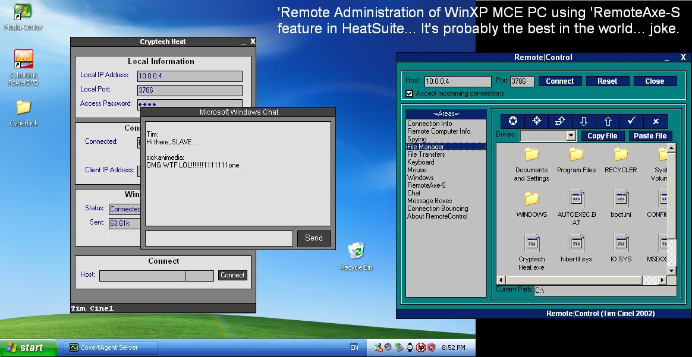

## RemoteControl 'Remote Administration' Suite

### Description

'Remotely Administer' computers on your home network, work network, across the street or across the globe using TCP/IP connections (FYI the internet uses TCP/IP).

Favourite feature - real 'remote desktop' with adjustable settings to accord to connection speed - you can use this over 56k modems... runs at like 6fps with 16bit colour over 100mbit ethernet.

You can have multiple servers and manage them through IRC, you can log keystrokes and user activity. There is a file browser that allows you to browse, shell, delete, download and upload files remotely. You can use the server as a proxy server, and bounce/tunnel conneetions. You can popup message boxes or request user input. Chat communication can be initiated between server and client. Keystrokes can be sent. Individual windows can be manipulated (hide,show,change caption, bring to front)

In the suite you receive a Server, Client, and Binder. Run the server on the computer(s) you want to control, run the client on the computer you will control from. The binder allows you to 'bind' the server executable to another executable so when the other executable is run, the server can install - also the settings can be bound with the server exec.

You can also do all that useless stuff like show/hide clock, desktop, programs, etc. Open/close CD drive too.

YOU MUST CONTACT ME IF YOU WORK ON THIS, I WOULD REALLY LIKE TO SEE THIS BE COMPLETED... PLEASE.

sickanimations [at] gmail [dot] com
 
### More Info
 

             |
---                |---
**Submitted On**   |2006-04-15 20:46:44
**By**             |[SickAnimations](https://github.com/Planet-Source-Code/PSCIndex/blob/master/ByAuthor/sickanimations.md)
**Level**          |Advanced
**User Rating**    |4.7 (42 globes from 9 users)
**Compatibility**  |VB 5\.0, VB 6\.0
**Category**       |[Internet/ HTML](https://github.com/Planet-Source-Code/PSCIndex/blob/master/ByCategory/internet-html__1-34.md)
**World**          |[Visual Basic](https://github.com/Planet-Source-Code/PSCIndex/blob/master/ByWorld/visual-basic.md)
**Archive File**   |[Heat\_\-\_Com1987144152006\.zip](https://github.com/Planet-Source-Code/sickanimations-remotecontrol-remote-administration-suite__1-65011/archive/master.zip)

